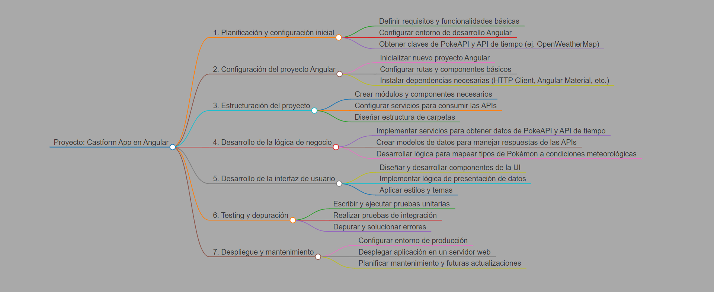

# Comandos pre instalación:

## Node
1. nvm install {{VERSION}} (22.2.0)
2. nvm use {{VERSION}} (22.2.0)

## NPM
1. npm install -g npm

## TypeScript:
1. npm install -g typescript@latest

## Angular:
1. npm install -g @angular/cli
2. ng -version

# Versiones:
* Angular: 18.0.2
* NPM: 10.8.1
* Node: 22.2.0
* TypeScript: 5.4.5

Este proyecto es una aplicación web desarrollada en Angular que muestra el clima de la península ibérica y las islas utilizando Pokémon para representar diferentes condiciones meteorológicas. Por ejemplo, mucho calor se representará con Groudon, y tormentas con Magneton.



# Estructuración del Proyecto
```
/src
|-- /app
|   |-- /components
|   |   |-- weather-card
|   |   |   |-- weather-card.component.html
|   |   |   |-- weather-card.component.ts
|   |   |   |-- weather-card.component.css
|   |-- /services
|   |   |-- weather.service.ts
|   |   |-- pokemon.service.ts
|   |-- /models
|   |   |-- weather.model.ts
|   |   |-- pokemon.model.ts
|   |-- /pages
|   |   |-- home
|   |   |   |-- home.component.html
|   |   |   |-- home.component.ts
|   |   |   |-- home.component.css
|   |-- app.module.ts
|   |-- app.component.html
|   |-- app.component.ts
|   |-- app.component.css
|-- /assets
|-- /environments
|   |-- environment.ts
|   |-- environment.prod.ts
|-- index.html
|-- main.ts
|-- styles.css
|-- angular.json
```
# Explicación de los Pasos
## Planificación y configuración inicial:

Requisitos y funcionalidades básicas: Definir qué características tendrá la aplicación y cómo funcionará.
Configuración del entorno de desarrollo: Configurar Angular y otras herramientas necesarias para el desarrollo.
Obtener claves de API: Registrar y obtener las claves necesarias para consumir la PokeAPI y una API de tiempo gratuita, como OpenWeatherMap.
Configuración del proyecto Angular:

Inicializar proyecto Angular: Crear un nuevo proyecto utilizando Angular CLI.
Configurar rutas y componentes básicos: Definir la estructura de rutas y crear componentes iniciales.
Instalar dependencias: Añadir librerías necesarias como HTTP Client para consumir APIs y Angular Material para estilos.
Estructuración del proyecto:

Crear módulos y componentes: Estructurar la aplicación en módulos y componentes según su funcionalidad.
Configurar servicios: Crear servicios para manejar las llamadas a la PokeAPI y la API de tiempo.
Diseñar estructura de carpetas: Organizar las carpetas y archivos para mantener el proyecto limpio y manejable.
Desarrollo de la lógica de negocio:

Implementar servicios: Escribir la lógica para consumir las APIs y obtener datos meteorológicos y de Pokémon.
Crear modelos de datos: Definir modelos para estructurar las respuestas de las APIs.
Mapear tipos de Pokémon: Desarrollar la lógica para asociar tipos de Pokémon con condiciones meteorológicas específicas.
Desarrollo de la interfaz de usuario:

Diseñar y desarrollar componentes de UI: Crear y estilizar los componentes que mostrarán la información.
Implementar lógica de presentación: Añadir la lógica necesaria para mostrar los datos de forma correcta.
Aplicar estilos y temas: Mejorar la apariencia de la aplicación usando CSS y Angular Material.
Testing y depuración:

Pruebas unitarias: Escribir pruebas para asegurarse de que los componentes y servicios funcionan correctamente.
Pruebas de integración: Verificar que los diferentes módulos de la aplicación trabajan bien juntos.
Depuración: Identificar y solucionar errores en la aplicación.
Despliegue y mantenimiento:

Configurar entorno de producción: Preparar la aplicación para ser desplegada en un servidor.
Desplegar aplicación: Subir la aplicación a un servidor web.
Mantenimiento y actualizaciones: Planificar el mantenimiento regular y las futuras mejoras.